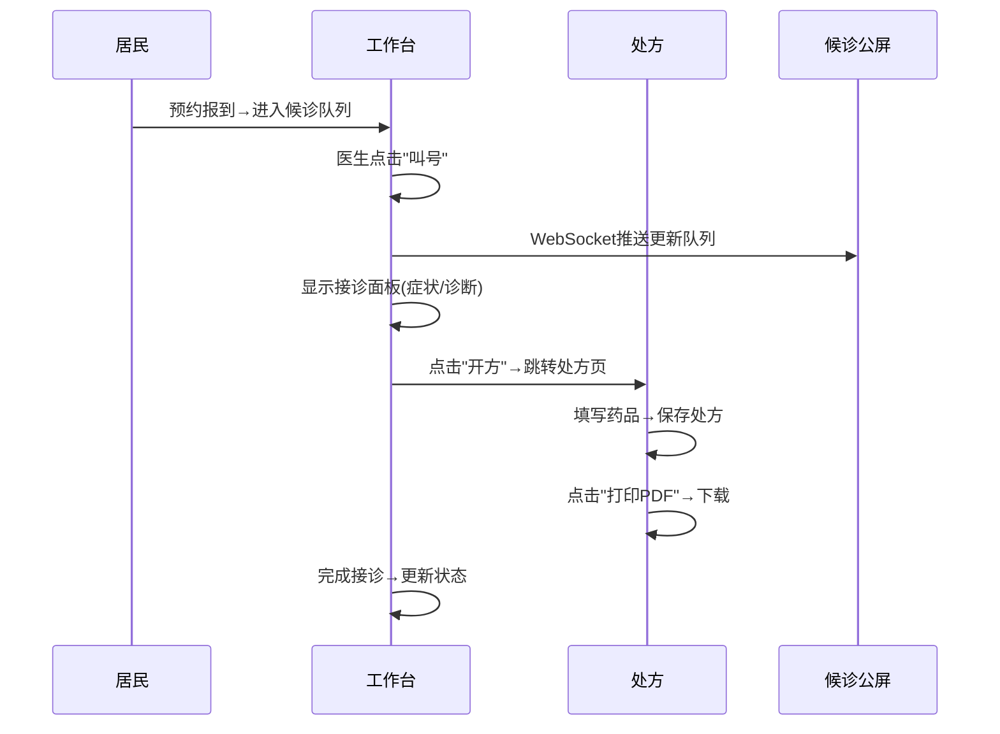
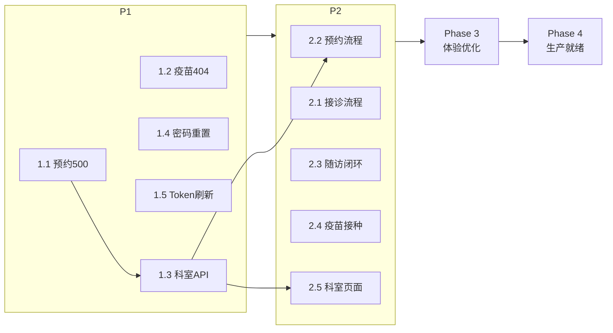

# 社区卫生服务平台 — 后续开发实施计划

> 制定时间：2026-03-15  
> 当前状态：75% 完成，29/29 API 测试通过，16/16 前端页面渲染正常

---

## Phase 1：Bug 修复与接口补全（优先级 P0）

> **目标**：消灭所有已知 404/500 错误，确保每个前端页面对接的 API 都畅通
> **预计工时**：1 天

---

### 1.1 修复预约号源查询 500 错误

**问题描述**：测试脚本调用 `/resident/appointment/slots?scheduleId=1` 返回 500，因为正确路径是 `/resident/appointment/slots/{scheduleId}`（PathVariable），且 scheduleId=1 在数据库中可能不存在。

**涉及文件**：
- [AppointmentController.java](file:///e:/ALL/gptcodex/NEW/backend/chp-resident/src/main/java/com/chp/resident/controller/AppointmentController.java#L84-L87)：路由已正确 `/slots/{scheduleId}`
- [test_api_full_v2.py](file:///e:/ALL/gptcodex/NEW/tools/test_api_full_v2.py)：修正测试路径

**修改内容**：
1. `AppointmentService.getSlots()` 添加空值安全返回
2. 测试脚本修正 URL 格式：`/resident/appointment/slots/<有效ID>`
3. 添加前端 `AppointmentPage.vue` 号源加载的错误捕获

**验证**：
```bash
python e:/ALL/gptcodex/NEW/tools/test_api_full_v2.py
# 确认 appointment_slot 测试项 PASS
```

---

### 1.2 修复疫苗接种记录 API 404

**问题描述**：测试脚本调用 `/resident/vaccine` 返回 404，正确路径应为 `/resident/vaccine/records`。

**涉及文件**：
- [VaccineController.java](file:///e:/ALL/gptcodex/NEW/backend/chp-resident/src/main/java/com/chp/resident/controller/VaccineController.java)：路由正确
- [test_api_full_v2.py](file:///e:/ALL/gptcodex/NEW/tools/test_api_full_v2.py)：修正测试路径
- [VaccinePage.vue](file:///e:/ALL/gptcodex/NEW/frontend/src/views/resident/vaccine/VaccinePage.vue)：确认 API 调用路径

**修改内容**：
1. 测试脚本将 `/resident/vaccine` 改为 `/resident/vaccine/records`
2. 前端 VaccinePage.vue 确认接口路径

**验证**：
```bash
python e:/ALL/gptcodex/NEW/tools/test_api_full_v2.py
# 确认 vaccine_record 测试项 PASS
```

---

### 1.3 实现科室管理 API

**问题描述**：测试脚本调用 `/admin/dept/list` 返回 404，该接口尚未实现。

**涉及文件（全部新建）**：
- `[NEW]` [DeptController.java](file:///e:/ALL/gptcodex/NEW/backend/chp-admin/src/main/java/com/chp/admin/controller/DeptController.java)
- `[NEW]` [DeptService.java](file:///e:/ALL/gptcodex/NEW/backend/chp-admin/src/main/java/com/chp/admin/service/DeptService.java)
- `[EXIST]` 数据库表 `chp_admin.dept`（4 条数据已存在）

**修改内容**：
```java
// DeptController.java
@RestController
@RequestMapping("/admin/dept")
public class DeptController {
    @GetMapping("/list")   // 全部科室列表
    @PostMapping           // 新增科室
    @PutMapping("/{id}")   // 更新科室
    @DeleteMapping("/{id}")// 删除科室
}
```

**Mapper**：直接使用 MyBatis-Plus 的 `BaseMapper<Dept>`，无需 XML。

**验证**：
```bash
# API 测试
curl -H "Authorization: Bearer <token>" http://localhost:8080/api/admin/dept/list
# 预期返回 4 条科室数据

python e:/ALL/gptcodex/NEW/tools/test_api_full_v2.py
# 确认 dept_list 测试项改回 200 且 PASS
```

---

### 1.4 重置 13800000001 密码

**问题描述**：UI 测试时密码被前端修改密码功能改掉，需重置为 `123456`。

**修改方式**：直接改库
```sql
-- 使用 BCrypt 编码的 "123456"
UPDATE chp_resident.resident
SET password = '$2a$10$...(BCrypt编码)'
WHERE phone = '13800000001';
```

**实现方式**：编写 Python 脚本执行 SQL + 使用 `AuthService` 中已有的 `BCryptPasswordEncoder` 生成密文。

**验证**：
```bash
# 测试登录
curl -X POST http://localhost:8080/api/auth/resident/login \
  -H 'Content-Type: application/json' \
  -d '{"phone":"13800000001","password":"123456"}'
# 预期 code=200
```

---

### 1.5 实现 Token 刷新接口

**涉及文件**：
- [AuthController.java](file:///e:/ALL/gptcodex/NEW/backend/chp-security/src/main/java/com/chp/security/controller/AuthController.java)：添加 `POST /auth/refresh`
- [AuthService.java](file:///e:/ALL/gptcodex/NEW/backend/chp-security/src/main/java/com/chp/security/service/AuthService.java)：添加 `refreshToken()` 方法
- [JwtUtils.java](file:///e:/ALL/gptcodex/NEW/backend/chp-security/src/main/java/com/chp/security/util/JwtUtils.java)：添加 `validateRefreshToken()` 方法
- [request.js](file:///e:/ALL/gptcodex/NEW/frontend/src/utils/request.js)：401 响应时自动尝试刷新 Token

**修改内容**：
```java
// AuthController.java
@PostMapping("/auth/refresh")
public Result<LoginVO> refresh(@RequestBody Map<String,String> body) {
    return Result.success(authService.refreshToken(body.get("refreshToken")));
}
```

**验证**：
```bash
# 1. 获取 refreshToken
# 2. 调用 /auth/refresh
# 3. 确认返回新的 accessToken + refreshToken
```

---

### Phase 1 完成标准
```
□ 29/29 API 回归全通过（去除 expected 404/500 标记）
□ 科室 API CRUD 正常
□ 13800000001 可正常登录
□ Token 刷新接口可用
□ Git commit: "fix: Phase1 完成 - Bug 修复与接口补全"
```

---

## Phase 2：业务流程打通（优先级 P1）

> **目标**：实现端到端业务闭环，让每个角色的核心工作流完整可用
> **预计工时**：2-3 天

---

### 2.1 接诊流程完善

**现状**：工作台可显示候诊队列（空状态），但缺少 接诊→开方→打印 的完整流程。

**涉及文件**：

| 文件 | 操作 | 说明 |
|------|------|------|
| [WorkbenchPage.vue](file:///e:/ALL/gptcodex/NEW/frontend/src/views/medical/workbench/WorkbenchPage.vue) | MODIFY | 添加"叫号"按钮→接诊面板→开方入口 |
| [WorkbenchService.java](file:///e:/ALL/gptcodex/NEW/backend/chp-medical/src/main/java/com/chp/medical/service/WorkbenchService.java) | MODIFY | `callNext()` 叫号→更新队列状态 |
| [WorkbenchController.java](file:///e:/ALL/gptcodex/NEW/backend/chp-medical/src/main/java/com/chp/medical/controller/WorkbenchController.java) | MODIFY | `POST /medical/workbench/call` 叫号接口 |
| [PrescriptionPage.vue](file:///e:/ALL/gptcodex/NEW/frontend/src/views/medical/prescription/PrescriptionPage.vue) | MODIFY | 从工作台跳转开方，添加开方表单 |
| [PrescriptionController.java](file:///e:/ALL/gptcodex/NEW/backend/chp-medical/src/main/java/com/chp/medical/controller/PrescriptionController.java) | MODIFY | 确认 `POST /medical/prescription` 创建处方 |

**业务流程**：


**验证**：
1. 创建测试预约数据 → 工作台出现候诊
2. 点击叫号 → WebSocket 公屏更新
3. 接诊 → 开方 → 打印 PDF → 完成
4. 浏览器 UI 测试全流程

---

### 2.2 预约流程完善

**现状**：API 完整（6 个接口），前端 `AppointmentPage.vue` 需优化交互。

**涉及文件**：

| 文件 | 操作 | 说明 |
|------|------|------|
| [AppointmentPage.vue](file:///e:/ALL/gptcodex/NEW/frontend/src/views/resident/appointment/AppointmentPage.vue) | MODIFY | 科室选择→日期→号源→提交预约 完整流程 |
| [AppointmentService.java](file:///e:/ALL/gptcodex/NEW/backend/chp-resident/src/main/java/com/chp/resident/service/AppointmentService.java) | OK | 已完整实现（175行） |
| [AppointmentController.java](file:///e:/ALL/gptcodex/NEW/backend/chp-resident/src/main/java/com/chp/resident/controller/AppointmentController.java) | OK | 6 个接口已完整 |

**前端改动**：
1. **选科室**：调用 `/admin/dept/list`（Phase 1.3 实现）显示科室列表
2. **选日期**：日期选择器（近 7 天）
3. **选号源**：调用 `/resident/appointment/schedules?deptCode=&date=` → 显示医生列表
4. **选时段**：调用 `/resident/appointment/slots/{scheduleId}` → 显示时段剩余号
5. **提交预约**：调用 `POST /resident/appointment`
6. **我的预约**：Tab 切换查看已预约/已完成/已取消

**验证**：浏览器 UI 测试完整预约→查看→取消流程

---

### 2.3 随访闭环

**现状**：后端 4 个接口（计划/今日/趋势/公卫记录），前端页面基础 UI 已有。

**涉及文件**：

| 文件 | 操作 | 说明 |
|------|------|------|
| [FollowUpPage.vue](file:///e:/ALL/gptcodex/NEW/frontend/src/views/medical/followup/FollowUpPage.vue) | MODIFY | 添加"新建随访"表单 + "录入记录"弹窗 |
| [FollowUpController.java](file:///e:/ALL/gptcodex/NEW/backend/chp-medical/src/main/java/com/chp/medical/controller/FollowUpController.java) | MODIFY | 补充 `POST /medical/follow-up/record` 录入记录 |
| [FollowUpService.java](file:///e:/ALL/gptcodex/NEW/backend/chp-medical/src/main/java/com/chp/medical/service/FollowUpService.java) | MODIFY | 补充 `createRecord()` 方法 |

**前端改动**：
1. **随访计划列表**：显示待随访/已完成
2. **新建随访计划**：选择居民→设定随访类型→频率
3. **录入随访记录**：血压/血糖/体重等健康指标
4. **趋势图表**：ECharts 折线图展示指标趋势（Phase 3 细化）

**验证**：
```bash
# API 测试
curl -X POST http://localhost:8080/api/medical/follow-up/record \
  -H "Authorization: Bearer <dr_token>" \
  -H "Content-Type: application/json" \
  -d '{"planId":1, "content":"血压 120/80", "result":"正常"}'
```

---

### 2.4 疫苗接种流程

**现状**：后端 4 个接口（预约/取消/预约列表/接种记录），前端页面可能需补充。

**涉及文件**：

| 文件 | 操作 | 说明 |
|------|------|------|
| [VaccinePage.vue](file:///e:/ALL/gptcodex/NEW/frontend/src/views/resident/vaccine/VaccinePage.vue) | MODIFY | 疫苗预约表单 + 接种记录查询 |
| [VaccineController.java](file:///e:/ALL/gptcodex/NEW/backend/chp-resident/src/main/java/com/chp/resident/controller/VaccineController.java) | OK | 4 个接口已完整 |
| [VaccineService.java](file:///e:/ALL/gptcodex/NEW/backend/chp-resident/src/main/java/com/chp/resident/service/VaccineService.java) | MODIFY | 补充疫苗库存查询 |

**前端改动**：
1. **疫苗列表**：显示可预约的疫苗种类（从 `chp_admin.vaccine` 查询）
2. **预约接种**：选疫苗→选日期→提交
3. **我的预约**：预约状态追踪
4. **接种记录**：历史接种卡片式展示

**验证**：浏览器 UI + API 测试

---

### 2.5 科室管理前端页面

**涉及文件**：
- `[NEW]` [DeptManagePage.vue](file:///e:/ALL/gptcodex/NEW/frontend/src/views/admin/dept/DeptManagePage.vue)
- [router/index.js](file:///e:/ALL/gptcodex/NEW/frontend/src/router/index.js)：添加 `/admin/dept` 路由
- [AdminLayout.vue](file:///e:/ALL/gptcodex/NEW/frontend/src/components/layout/AdminLayout.vue)：菜单添加"科室管理"

**验证**：浏览器 UI 测试 CRUD

---

### Phase 2 完成标准
```
□ 接诊流程：叫号→接诊→开方→打印 全流程可用
□ 预约流程：选科→选医生→选号源→提交 全流程可用
□ 随访闭环：创建计划→录入记录→查看趋势
□ 疫苗接种：预约→接种记录查看
□ 科室管理：CRUD 页面完整
□ Git commit: "feat: Phase2 完成 - 核心业务流程闭环"
```

---

## Phase 3：体验优化（优先级 P2）

> **目标**：提升 UI 品质、数据可视化、操作便利性
> **预计工时**：2-3 天

---

### 3.1 ECharts 数据可视化

**涉及文件**：

| 文件 | 操作 | 说明 |
|------|------|------|
| `package.json` | MODIFY | 添加 `echarts` + `vue-echarts` 依赖 |
| [DashboardPage.vue](file:///e:/ALL/gptcodex/NEW/frontend/src/views/admin/dashboard/DashboardPage.vue) | MODIFY | 添加 4 个图表区 |
| [FollowUpPage.vue](file:///e:/ALL/gptcodex/NEW/frontend/src/views/medical/followup/FollowUpPage.vue) | MODIFY | 添加趋势折线图 |
| [ReportController.java](file:///e:/ALL/gptcodex/NEW/backend/chp-admin/src/main/java/com/chp/admin/controller/ReportController.java) | MODIFY | 添加图表数据接口 |

**图表清单**：
1. **仪表盘**：近 7 天就诊量柱状图 + 药品消耗 Top5 饼图
2. **仪表盘**：预约趋势折线图 + 科室负荷热力图
3. **随访**：血压/血糖趋势折线图
4. **报表页**：月度报表汇总（可选）

---

### 3.2 AOP 审计日志

**涉及文件**：
- `[NEW]` [AuditLogAspect.java](file:///e:/ALL/gptcodex/NEW/backend/chp-common/src/main/java/com/chp/common/aspect/AuditLogAspect.java)
- `[NEW]` [AuditLog 注解](file:///e:/ALL/gptcodex/NEW/backend/chp-common/src/main/java/com/chp/common/annotation/AuditLog.java)
- 各 Controller：在关键操作方法上添加 `@AuditLog("描述")`

**实现**：
```java
@Aspect @Component
public class AuditLogAspect {
    @Around("@annotation(auditLog)")
    public Object around(ProceedingJoinPoint pjp, AuditLog auditLog) {
        // 记录：操作人/操作时间/模块/操作/IP/参数/结果
    }
}
```

---

### 3.3 WebSocket 消息推送到居民端

**涉及文件**：
- [QueueWebSocketHandler.java](file:///e:/ALL/gptcodex/NEW/backend/chp-starter/src/main/java/com/chp/starter/config/QueueWebSocketHandler.java) | MODIFY
- `[NEW]` `NoticeWebSocketHandler.java`：居民端消息推送
- [MessagePage.vue](file:///e:/ALL/gptcodex/NEW/frontend/src/views/resident/message/MessagePage.vue) | MODIFY

---

### 3.4 表单校验完善

**涉及文件**：所有带表单的 `.vue` 文件，添加 Element Plus 的 `el-form` 规则校验。

**清单**：
- 登录表单：必填 + 手机号格式
- 预约表单：科室/日期/时段必选
- 开方表单：药品/用量/频次必填
- 用户管理：用户名/手机号/角色必填
- 修改密码：旧密码 + 新密码 + 确认密码

---

### 3.5 居民端响应式优化

**涉及文件**：
- [ResidentLayout.vue](file:///e:/ALL/gptcodex/NEW/frontend/src/components/layout/ResidentLayout.vue)
- 所有 `/resident/*.vue` 页面

**改动**：
- 底部导航固定
- 卡片布局移动端适配
- 触摸滑动手势

---

### Phase 3 完成标准
```
□ 仪表盘有至少 2 个 ECharts 图表
□ 审计日志自动记录关键操作
□ 居民端可收到 WebSocket 消息
□ 所有表单有完整校验
□ 居民端移动端可正常使用
□ Git commit: "feat: Phase3 完成 - 体验优化"
```

---

## Phase 4：生产就绪（优先级 P3）

> **目标**：可部署、可运维、可扩展
> **预计工时**：3-5 天

---

### 4.1 Docker 容器化

**新增文件**：
```
NEW/
├── Dockerfile.backend          # 后端 JDK21 + JAR
├── Dockerfile.frontend         # 前端 Nginx + dist
├── docker-compose.yml          # 编排: frontend + backend + mysql + redis
├── nginx/
│   └── default.conf            # Nginx 反向代理 /api → backend:8080
└── .dockerignore
```

---

### 4.2 Redis 替换 Caffeine

**涉及文件**：
- `pom.xml`：添加 `spring-boot-starter-data-redis`
- [AuthService.java](file:///e:/ALL/gptcodex/NEW/backend/chp-security/src/main/java/com/chp/security/service/AuthService.java)：`loginFailCache` 改用 RedisTemplate
- `application-prod.yml`：Redis 连接配置

---

### 4.3 文件存储

**涉及文件**：
- `[NEW]` `FileController.java`：上传/下载接口
- `[NEW]` `FileService.java`：MinIO/本地存储适配
- 处方 PDF 存储 + 头像上传

---

### 4.4 API 文档完善

**涉及文件**：所有 Controller，添加 `@Operation` / `@Tag` / `@Parameter` SpringDoc 注解。

---

### 4.5 安全加固

- CORS 精细配置（仅允许指定域名）
- Rate Limiting（接口限流）
- 敏感数据脱敏（手机号/身份证）
- XSS/CSRF 防护

---

### 4.6 E2E 自动化测试

**新增文件**：
```
NEW/tests/
├── e2e/
│   ├── login.spec.js           # 登录流程
│   ├── appointment.spec.js     # 预约流程
│   ├── workbench.spec.js       # 接诊流程
│   └── admin.spec.js           # 管理后台
└── playwright.config.js
```

---

### Phase 4 完成标准
```
□ docker-compose up 一键启动全部服务
□ Redis 会话管理 + 分布式缓存
□ 文件上传/下载正常
□ Swagger UI 可访问且文档完整
□ E2E 测试覆盖核心流程
□ Git commit: "feat: Phase4 完成 - 生产就绪"
```

---

## 依赖关系与执行顺序



---

## 验证计划

### 自动化测试
每完成一个 Phase，执行以下测试：
```bash
# 1. API 全量回归
python e:/ALL/gptcodex/NEW/tools/test_api_full_v2.py

# 2. Maven 构建验证
cd e:/ALL/gptcodex/NEW/backend && mvn clean install -DskipTests -q

# 3. 前端构建验证
cd e:/ALL/gptcodex/NEW/frontend && npm run build
```

### 浏览器 UI 测试
每个 Phase 完成后使用浏览器子代理执行：
1. 管理员登录 → 遍历所有管理页面
2. 医生登录 → 遍历所有医护页面
3. 居民登录 → 遍历所有居民页面
4. 公屏页面
5. 记录所有报错到 Bug 清单

### Git 提交规范
```
feat: Phase<N> 完成 - <简要描述>
fix: 修复<具体问题>
```
