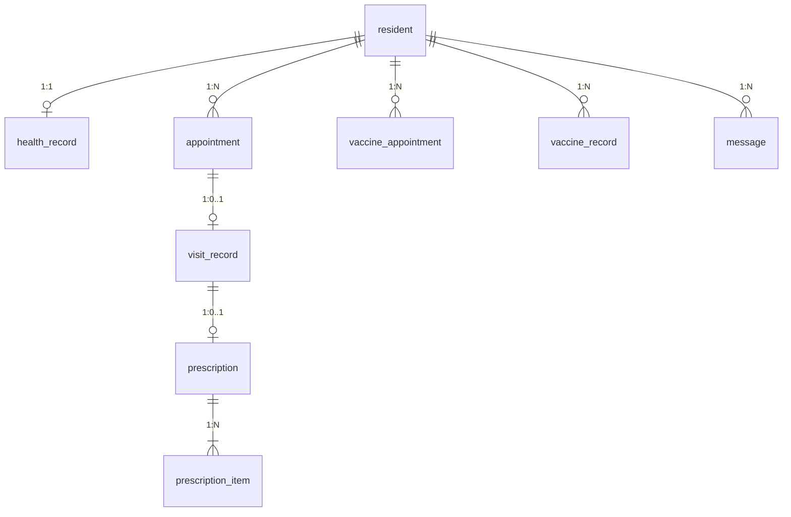
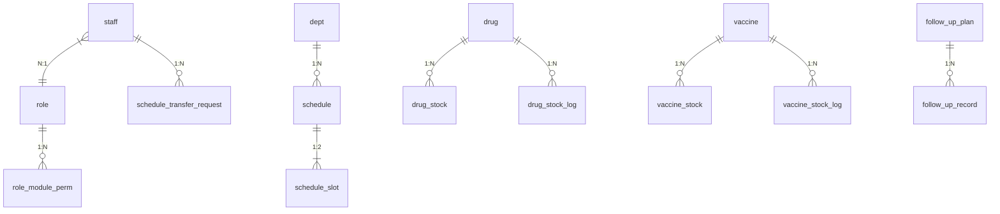

# 数据库设计文档（V2.0 修正版）

> 基础文档：根目录 `design.md` 第四章建表 SQL
> 本文档包含**完整修正版 SQL**，以本文档为准。
> 变更：补充 2 张缺失表、新增索引、统一软删除策略

---

## 一、设计原则

- 双数据源：`chp_resident` + `chp_admin`
- 软删除：核心业务表 `is_deleted` + `deleted_at`，流水表只追加不删除
- 乐观锁：`schedule_slot.version` 防超卖
- 审计字段：`created_at` / `updated_at`
- 字符集：`utf8mb4`

### 软删除范围

| 使用软删除 | 不使用（只追加或状态标记） |
|-----------|-------------------------|
| resident, staff, drug, vaccine | drug_stock_log, vaccine_stock_log, audit_log |
| health_record, appointment, prescription | follow_up_record, vaccine_record, prescription_item |
| vaccine_appointment, follow_up_plan | message, schedule, role, dept, notice, sys_config |
| public_health_record | schedule_transfer_request |

## 二、数据域

```
chp_resident（居民域）           chp_admin（管理域）
─────────────────             ───────────────────
resident                       staff, role, module_permission, role_module_perm
health_record                  dept, schedule, schedule_slot
appointment                    schedule_transfer_request ← 新增
visit_record                   drug, drug_stock, drug_stock_log
prescription                   vaccine, vaccine_stock
prescription_item              vaccine_stock_log ← 新增
vaccine_appointment            follow_up_plan, follow_up_record
vaccine_record                 public_health_record, icd_code
message                        audit_log, sys_config, notice
```

## 三、V2.0 修正清单

| # | 变更 | 说明 |
|---|------|------|
| 1 | 🆕 `schedule_transfer_request` 表 | 调班申请/审批接口需要 |
| 2 | 🆕 `vaccine_stock_log` 表 | 接种登记需写入流水 |
| 3 | 🆕 `appointment.idx_resident_dept_date` | 重复预约校验索引 |
| 4 | 🆕 `follow_up_plan.idx_resident_chronic` | 唯一计划校验辅助索引 |
| 5 | 🆕 `sys_config` 新增密码和登录安全配置 | 密码复杂度/锁定参数 |

## 四、新增表 SQL

### 4.1 调班申请表（chp_admin）

```sql
CREATE TABLE schedule_transfer_request (
    id              BIGINT      NOT NULL AUTO_INCREMENT,
    schedule_id     BIGINT      NOT NULL      COMMENT '原排班ID',
    staff_id        BIGINT      NOT NULL      COMMENT '申请人ID',
    staff_name      VARCHAR(20) NOT NULL      COMMENT '申请人姓名',
    request_reason  VARCHAR(200) NOT NULL     COMMENT '调班原因',
    status          TINYINT(1)  NOT NULL DEFAULT 0 COMMENT '0待审批 1通过 2驳回',
    approver_id     BIGINT      NULL          COMMENT '审批人ID',
    approver_name   VARCHAR(20) NULL,
    reject_reason   VARCHAR(200) NULL,
    created_at      DATETIME    NOT NULL DEFAULT CURRENT_TIMESTAMP,
    updated_at      DATETIME    NOT NULL DEFAULT CURRENT_TIMESTAMP ON UPDATE CURRENT_TIMESTAMP,
    PRIMARY KEY (id),
    KEY idx_staff_id (staff_id),
    KEY idx_schedule_id (schedule_id),
    KEY idx_status (status)
) ENGINE=InnoDB DEFAULT CHARSET=utf8mb4 COMMENT='调班申请';
```

### 4.2 疫苗出入库流水表（chp_admin）

```sql
CREATE TABLE vaccine_stock_log (
    id              BIGINT      NOT NULL AUTO_INCREMENT,
    vaccine_id      BIGINT      NOT NULL,
    vaccine_name    VARCHAR(100) NOT NULL     COMMENT '冗余快照',
    batch_no        VARCHAR(50) NOT NULL,
    op_type         TINYINT(1)  NOT NULL      COMMENT '1入库 2出库(接种) 3盘点 4报废',
    quantity        INT         NOT NULL,
    direction       TINYINT(1)  NOT NULL      COMMENT '1增加 2减少',
    balance         INT         NOT NULL      COMMENT '操作后余量',
    related_id      BIGINT      NULL          COMMENT '关联单据ID',
    operator_id     BIGINT      NOT NULL,
    operator_name   VARCHAR(20) NOT NULL,
    op_time         DATETIME    NOT NULL DEFAULT CURRENT_TIMESTAMP,
    remark          VARCHAR(200) NULL,
    PRIMARY KEY (id),
    KEY idx_vaccine_id (vaccine_id),
    KEY idx_op_time (op_time),
    KEY idx_op_type (op_type)
) ENGINE=InnoDB DEFAULT CHARSET=utf8mb4 COMMENT='疫苗出入库流水';
```

## 五、新增索引 SQL

```sql
-- 在 chp_resident.appointment 表上添加（重复预约校验）
ALTER TABLE chp_resident.appointment
  ADD KEY idx_resident_dept_date (resident_id, dept_code, appt_date);

-- 在 chp_admin.follow_up_plan 表上添加（同居民同病种唯一计划）
ALTER TABLE chp_admin.follow_up_plan
  ADD KEY idx_resident_chronic (resident_id, chronic_type, status);
```

## 六、新增系统配置

```sql
INSERT INTO chp_admin.sys_config (config_key, config_value, config_name, config_group) VALUES
('pwd.min_length',        '6',  '密码最小长度',       'security'),
('pwd.max_length',        '20', '密码最大长度',       'security'),
('login.max_fail_count',  '5',  '最大登录失败次数',   'security'),
('login.lock_minutes',    '30', '登录锁定分钟数',     'security');
```

## 七、ER 图

### 居民域


### 管理域


> **完整原始建表 SQL** 请参考根目录 `design.md` 第四章，本文档中的新增表和索引需要追加执行。
