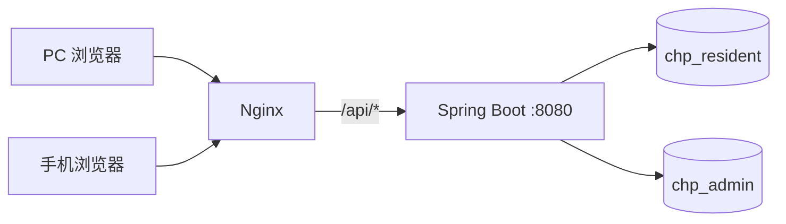
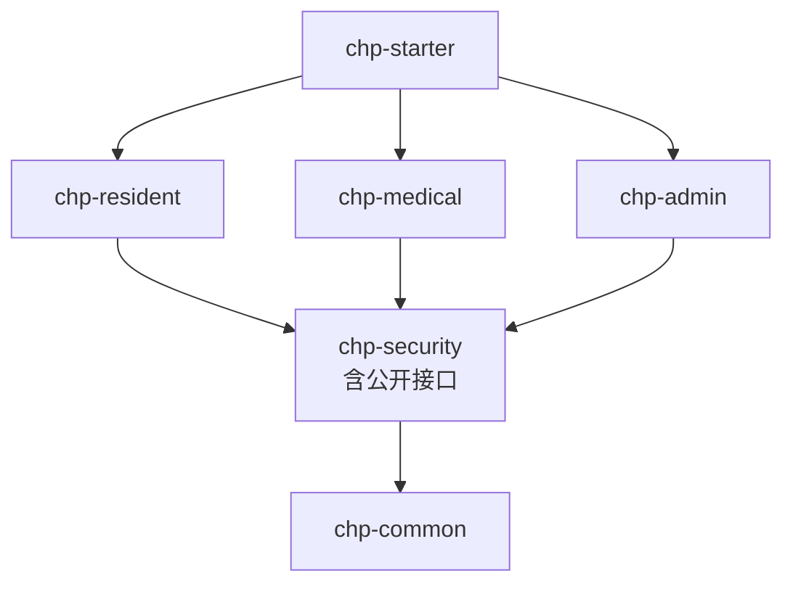
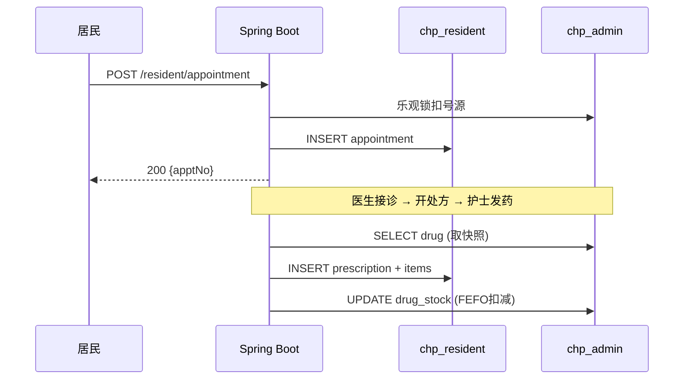

# 社区卫生服务中心平台 · 系统架构说明书

> V2.0 修正版 | 基础文档：根目录 `design.md`

---

## 一、项目概述

面向基层社区卫生服务中心的一体化信息管理平台。Spring Boot 3 + Vue 3 前后端分离。
- **居民端**：预约挂号、查档案、接种预约、就诊记录
- **医护端**：接诊、开方、发药、档案管理、慢病随访
- **管理员**：用户权限、排班配置、药品/疫苗库存、统计报表
- **科室**：全科门诊 / 口腔科 / 妇幼保健科 / 公共卫生科

## 二、技术栈

| 层次 | 技术 | 版本 |
|------|------|------|
| 前端 | Vue 3 + Element Plus + Pinia + Axios | 3.x |
| 后端 | Spring Boot 3 + MyBatis-Plus + MySQL 8 | 3.2.x |
| 缓存 | Caffeine（本地，不引入 Redis） | 3.x |
| 安全 | Spring Security + JWT | 6.x |
| PDF | iText 7 | 7.x |
| Excel | EasyExcel | 3.x |

## 三、关键设计决策

### 不引入 Redis
日均 100-300 人次，MySQL 乐观锁防超卖，Caffeine 做字典缓存。
- 登录失败计数 → Caffeine `expireAfterWrite(30min)`
- JWT 退出 → 短有效期 2h + 请求时查用户 status 字段

### 双数据源
`chp_resident`（居民域）+ `chp_admin`（管理域）物理隔离。
- **快照冗余**（prescription_item 的药品名/规格）：写入时固化，永不更新
- **引用冗余**（appointment 的 staff_name）：创建时写入，历史保持原值
- **跨库事务**：先写核心操作，再写辅助操作，失败时补偿

### Caffeine 缓存

| 缓存项 | maximumSize | TTL | Evict 触发点 |
|--------|-------------|-----|-------------|
| 科室列表 | 50 | 24h | 修改科室时 |
| 药品字典 | 2000 | 24h | 入库/修改时 |
| 疫苗字典 | 500 | 24h | 修改时 |
| ICD-10 | 5000 | 24h | 管理员维护时 |
| 系统配置 | 100 | 1h | 修改配置时 |
| 登录失败计数 | 10000 | 30min | 登录成功清除 |

## 四、部署架构

## 五、Maven 模块

> **优化**：原 `chp-public` 模块合并入 `chp-security`。

## 六、HTTP 状态码策略（修正）

| HTTP 状态码 | code | 含义 |
|-------------|------|------|
| 200 | 200 | 成功 |
| 200 | 10001-10006 | 业务错误（号源满/重复预约/库存不足等） |
| 400 | 400 | 参数校验失败 |
| 401 | 401 | 未登录/Token 过期 |
| 403 | 403 | 无权限 |
| 500 | 500 | 服务器异常 |

> **修正说明**：不再统一返回 HTTP 200，标准错误使用对应的 HTTP 状态码。

## 七、核心业务流程

## 八、定时任务

| 任务 | cron | 说明 |
|------|------|------|
| 预约超时 | 23:30 每日 | 当日待就诊→未到诊 |
| 随访预警 | 06:00 每日 | 7天内到期→写消息 |
| 复诊提醒 | 08:00 每日 | 当日复诊→站内消息 |
| 药品/疫苗效期 | 07:00 每日 | 30天内到期→预警 |
