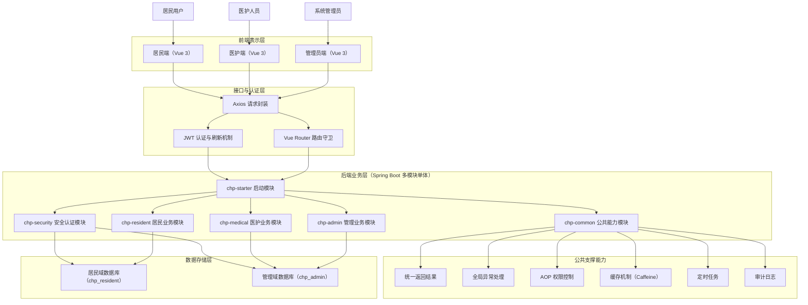

# 系统总体架构图（Mermaid 正式版）

下面这版更适合直接放进论文初稿或作为 draw.io 重绘底稿。

## 1. Mermaid 代码

---

## 2. 论文配图标题建议

建议标题写成：

**图 4-1 系统总体架构图**

---

## 3. 图下注释建议

可直接放在论文中的说明文字：

本系统采用前后端分离架构。前端按照居民端、医护端和管理员端三类角色组织页面；后端采用 Spring Boot 多模块单体架构，并划分为公共能力、安全认证、居民业务、医护业务和管理业务等模块。数据层采用双数据源方案，将居民域数据与管理域数据分开存储，以提升系统结构清晰度与数据边界性。

---

## 4. 使用建议

1. 如果直接放论文，建议先截图或导出 SVG，再插入 Word。
2. 如果后续要做正式美化，可以把这版结构导入 draw.io 重新绘制。
3. 如果老师更偏好“论文风”配图，建议在 draw.io 中改成分层矩形框样式，减少箭头交叉。

