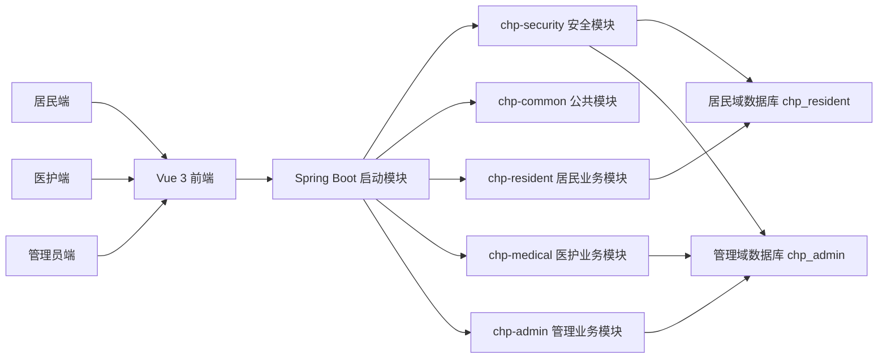
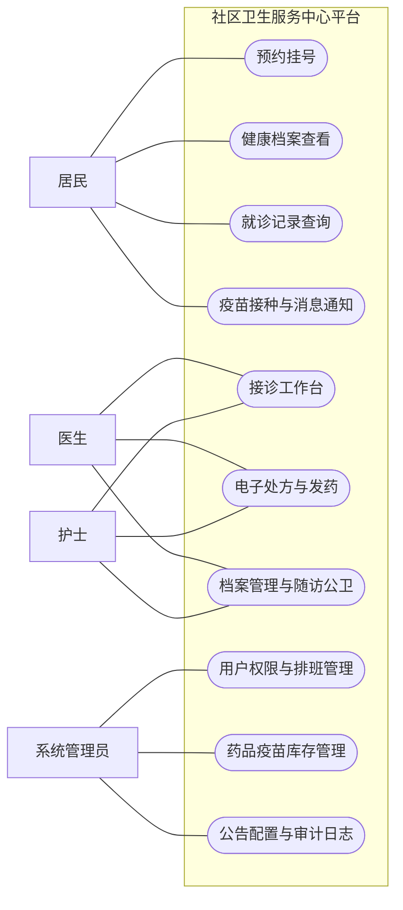

# 论文配图清单与绘制方案

> 适用论文题目：**《基于 Spring Boot 的社区卫生服务中心平台的设计与实现》**
>
> 目的：明确论文中建议保留的图、每张图适合使用的工具、推荐绘制顺序，以及可直接作为草稿使用的 Mermaid 文本。

---

## 1. 配图总体建议

对于当前这个项目，论文中的图不需要追求“特别花”，重点是：

1. 图的类型齐全
2. 能支撑章节内容
3. 命名规范
4. 风格统一
5. 后续容易修改

从效率和实际效果来看，建议采用下面这套组合：

- **draw.io / ProcessOn**：画架构图、功能模块图、流程图
- **PowerDesigner / Navicat / draw.io**：画 ER 图、数据库结构图
- **PPT**：统一美化、加标题、调整字体和配色
- **系统截图**：界面实现图、测试结果图
- **Mermaid**：先快速起草结构，再转成正式图

不建议一开始就把所有图都放在同一个软件里硬画。更合理的方式是：

- 先用 Mermaid 或文字把结构定下来
- 再用 draw.io 或 PPT 画成论文用图

---

## 2. 建议保留的图

按论文章节来看，建议至少准备下面这些图。

### 第 1 章 绪论

#### 图 1-1 课题研究内容与论文结构关系图

作用：
- 说明论文整体研究内容
- 让读者快速看到“需求分析—总体设计—系统实现—系统测试”的关系

推荐工具：
- draw.io
- PPT

建议程度：
- **建议保留**

---

### 第 3 章 系统分析

#### 图 3-1 系统角色用例图

作用：
- 展示居民、医护人员、系统管理员三类角色与主要功能的关系

推荐工具：
- PlantUML
- draw.io
- ProcessOn

建议程度：
- **必须保留**

#### 图 3-2 居民端功能模块图

作用：
- 展示居民端的一级功能结构

建议模块：
- 首页
- 预约管理
- 健康信息
- 消息通知
- 个人中心

建议程度：
- **建议保留**

#### 图 3-3 医护端功能模块图

建议模块：
- 接诊工作台
- 电子处方
- 发药管理
- 档案管理
- 随访与公卫
- 接种管理
- 排班查看

建议程度：
- **建议保留**

#### 图 3-4 管理员端功能模块图

建议模块：
- 用户与权限管理
- 排班与号源管理
- 药品库存管理
- 疫苗库存管理
- 基础数据字典
- 报表统计
- 公告与系统配置
- 审计日志

建议程度：
- **建议保留**

---

### 第 4 章 系统总体设计

#### 图 4-1 系统总体架构图

作用：
- 展示前端三端、后端多模块、双数据源的关系

建议程度：
- **必须保留**

#### 图 4-2 系统功能模块总图

作用：
- 从全局角度展示三端与公共支撑层

建议程度：
- **建议保留**

#### 图 4-3 居民域数据库 ER 图

作用：
- 展示居民、健康档案、预约、就诊记录、消息、疫苗记录等实体关系

建议程度：
- **必须保留**

#### 图 4-4 管理域数据库 ER 图

作用：
- 展示 staff、role、dept、schedule、drug、vaccine、follow_up、notice、sys_config、audit_log 等实体关系

建议程度：
- **必须保留**

#### 图 4-5 预约挂号业务流程图

作用：
- 展示居民预约流程

建议程度：
- **必须保留**

#### 图 4-6 接诊与处方业务流程图

作用：
- 展示居民预约、医护接诊、处方开具的关系

建议程度：
- **必须保留**

#### 图 4-7 发药与库存流转图

作用：
- 展示处方、发药、库存变化之间的关系

建议程度：
- **建议保留**

---

### 第 5 章 系统实现

这一章建议主要使用**系统截图**。

建议保留：

- 图 5-1 登录页面
- 图 5-3 居民首页
- 图 5-4 预约挂号页
- 图 5-5 健康档案页
- 图 5-6 就诊记录页
- 图 5-9 接诊工作台
- 图 5-10 电子处方页
- 图 5-11 药房发药页
- 图 5-14 药品库存页
- 图 5-16 管理驾驶舱页

这些图不需要再“画”，直接截图后统一裁剪、编号和加边框即可。

---

### 第 6 章 系统测试

#### 图 6-1 系统测试环境示意图

作用：
- 展示前端、后端、数据库和测试工具关系

建议程度：
- **可保留**

#### 图 6-2 接口测试结果图

作用：
- 展示接口测试通过结果

建议方式：
- 截图 `test_result.txt`
- 或者整理成表格

建议程度：
- **建议保留**

---

### 第 7 章 总结与展望

#### 图 7-1 系统后续优化方向示意图

作用：
- 概括后续可继续扩展的方向

例如：
- 响应式适配完善
- 测试体系增强
- 权限颗粒度优化
- 数据统计增强
- 部署运维优化

建议程度：
- **可选**

---

## 3. 最推荐先画的 8 张图

如果时间有限，优先把下面 8 张图做出来：

1. 图 3-1 系统角色用例图
2. 图 4-1 系统总体架构图
3. 图 4-3 居民域数据库 ER 图
4. 图 4-4 管理域数据库 ER 图
5. 图 4-5 预约挂号业务流程图
6. 图 4-6 接诊与处方业务流程图
7. 图 5-3 居民首页界面图
8. 图 5-16 管理驾驶舱界面图

这 8 张图最能撑起论文的骨架。

---

## 4. 推荐绘制顺序

### 第一轮：先把结构图和流程图画出来

1. 系统角色用例图
2. 系统总体架构图
3. 功能模块图
4. 预约流程图
5. 接诊处方流程图

原因：
- 这些图和论文正文的结构绑定最紧
- 先做出来，后面写作最省力

### 第二轮：补数据库图

1. 居民域 ER 图
2. 管理域 ER 图

原因：
- 数据库图最依赖最终表结构
- 放在第二轮比较稳

### 第三轮：补系统截图

1. 登录页
2. 居民首页
3. 预约页
4. 健康档案页
5. 接诊工作台
6. 电子处方页
7. 管理驾驶舱

原因：
- 截图要尽量靠后，避免界面又改

---

## 5. 各类图的推荐工具

### 5.1 架构图、模块图、流程图

推荐：
- draw.io
- ProcessOn
- Mermaid 起草

建议：
- 先用 Mermaid 定结构
- 再转到 draw.io 正式绘制

### 5.2 UML 用例图

推荐：
- draw.io
- PlantUML
- StarUML

建议：
- 如果学校不严格要求 UML 规范，draw.io 完全够用

### 5.3 ER 图

推荐：
- PowerDesigner
- Navicat
- draw.io

建议：
- 如果想快一些，draw.io 也能画
- 如果想更“论文味”，PowerDesigner 更正式

### 5.4 系统界面图

推荐：
- 页面截图
- 用 PPT 加边框和标题

建议：
- 统一宽度
- 统一标题样式
- 截图时尽量用正式数据

---

## 6. Mermaid 草稿

下面这些 Mermaid 文本可以直接当作初稿使用。

### 6.1 系统总体架构图草稿

---

### 6.2 系统角色用例图草稿

---

### 6.3 预约挂号流程图草稿

---

### 6.4 接诊与处方流程图草稿

---

## 7. 论文截图建议

系统截图建议统一按下面方式处理：

1. 浏览器或系统窗口尽量裁剪干净
2. 不要保留开发工具面板
3. 页面数据尽量不要全是空列表
4. 同一章中的截图宽度尽量统一
5. 图下说明要简洁，例如：
   - 图 5-3 居民首页界面
   - 图 5-10 电子处方页面

建议优先截图的页面：

- 登录页
- 居民首页
- 预约挂号页
- 健康档案页
- 接诊工作台
- 电子处方页
- 药房发药页
- 管理驾驶舱

---

## 8. 分工建议

如果组里多人协作，可以按下面方式分工：

### 同学 A
- 系统总体架构图
- 角色用例图
- 功能模块图

### 同学 B
- 预约流程图
- 接诊处方流程图
- 发药库存流程图

### 同学 C
- 居民域 ER 图
- 管理域 ER 图

### 同学 D
- 系统页面截图整理
- 测试结果截图整理
- PPT 统一美化

---

## 9. 最终建议

如果现在要尽快推进，建议直接这样做：

1. 先用本文档里的 Mermaid 草稿确定结构
2. 再用 draw.io 画正式图
3. 数据库图单独做
4. 页面图最后截图
5. 用 PPT 统一编号、边框和样式

这样效率最高，也最适合当前毕设推进节奏。

