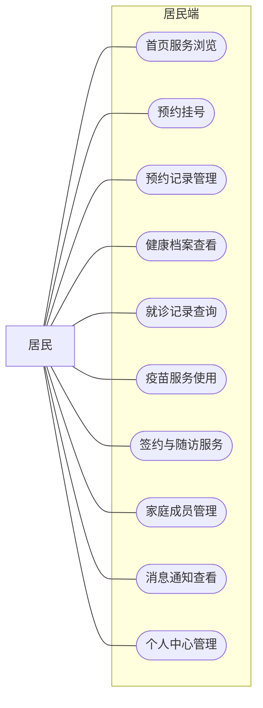
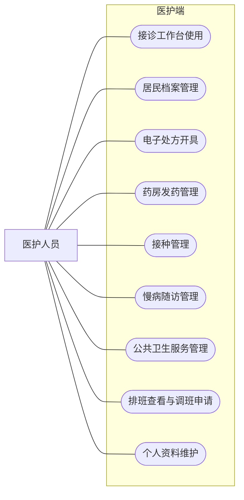
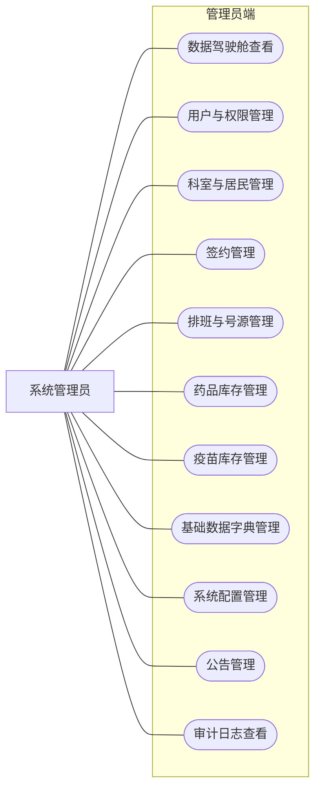

# 3.1 系统需求分析

## 3.1.1 功能需求分析

结合社区卫生服务中心日常诊疗、健康管理与后台运行维护的实际需求，本平台面向居民、医护人员和系统管理员三类核心角色开展设计。不同角色在平台中的使用目标并不相同，但三者之间又通过预约、接诊、处方、库存、随访、公卫和消息提醒等业务链路形成协同关系，共同构成社区卫生服务中心平台的整体功能体系。各类角色的具体功能需求如下。

居民角色是平台面向服务对象的一侧，主要借助平台完成预约挂号、健康信息查询与日常服务接收等操作，其核心功能需求主要包括：

1. **首页服务浏览**：居民可在首页查看平台公告、待就诊提醒、消息摘要以及常用服务入口，及时了解社区卫生服务中心发布的信息与当前个人服务状态；
2. **预约挂号**：居民可查看可预约科室、医生排班和号源时段，选择合适时间提交预约申请，并查看预约结果；
3. **预约记录管理**：居民可查询历史预约记录，了解预约状态变化，并在允许的条件下取消预约；
4. **健康档案查看**：居民可查看个人健康档案信息，包括基础信息、慢病标签、过敏史、家族史、紧急联系人以及近期生命体征摘要；
5. **就诊记录查询**：居民可查询历史就诊记录，查看诊断结果、医嘱及相关处方信息，掌握个人诊疗情况；
6. **疫苗服务使用**：居民可查看可预约疫苗信息、提交接种预约，并查询个人接种记录；
7. **签约与随访服务**：居民可查看签约信息、随访计划和随访记录，了解社区卫生服务中的长期健康管理安排；
8. **家庭成员管理**：居民可维护家庭成员信息，支持在家庭健康服务场景下进行代办或代查操作；
9. **消息通知查看**：居民可查看预约提醒、随访提醒、接种提醒和系统通知等消息内容，掌握与个人健康服务相关的动态信息；
10. **个人中心管理**：居民可在个人中心查看和维护个人资料，修改手机号、密码以及紧急联系人等信息。

居民用例图如图 3-1 所示。

**图 3-1 居民用例图**

医护人员角色是平台中的业务执行主体，主要借助平台完成接诊、处方、发药、档案维护以及长期健康服务等工作。考虑到社区卫生服务中心中医生与护士的职责存在差异，系统在同一医护端内兼顾了诊疗操作与护理协同两类需求，其核心功能需求主要包括：

1. **接诊工作台使用**：医护人员可查看当日候诊队列，执行叫号、开始接诊和完成接诊等操作，提升门诊处理效率；
2. **居民档案管理**：医护人员可查询居民健康档案，并根据业务权限对相关档案信息进行维护；
3. **电子处方开具**：医生可依据接诊结果录入药品、剂量、频次和天数等内容，形成电子处方；
4. **药房发药管理**：相关医护人员可查看待发药处方，核对处方明细后完成发药登记，并记录发药结果；
5. **接种管理**：医护人员可登记接种操作，维护接种记录及异常反应等信息；
6. **慢病随访管理**：医护人员可查看随访计划、记录随访结果，并跟踪居民健康状况变化；
7. **公共卫生服务管理**：医护人员可录入和查看老年人、孕产妇、儿童保健等公卫服务记录；
8. **排班查看与调班申请**：医护人员可查看个人排班安排，并在需要时发起调班申请；
9. **个人资料维护**：医护人员可在个人中心维护个人资料、安全设置及专业信息。

医护人员用例图如图 3-2 所示。

**图 3-2 医护人员用例图**

系统管理员角色是平台的运行维护主体，主要负责人员、资源、规则和系统配置等内容的集中管理，为居民服务和医护业务提供支撑条件。其核心功能需求主要包括：

1. **数据驾驶舱查看**：管理员可查看系统运行概览、就诊趋势、签约统计、随访统计和公告摘要等信息；
2. **用户与权限管理**：管理员可维护医护人员账号、角色与权限关系，确保不同角色访问范围符合平台规则；
3. **科室与居民管理**：管理员可维护科室信息，查看居民基础数据，为平台运行提供组织与对象基础；
4. **签约管理**：管理员可查看和处理签约申请，维护签约服务相关数据；
5. **排班与号源管理**：管理员可对科室排班、号源数量、停诊信息和调班审批进行管理；
6. **药品库存管理**：管理员可查看药品字典、库存信息、出入库日志和效期情况，保障药房业务正常运行；
7. **疫苗库存管理**：管理员可维护疫苗库存、批次、预警和日志信息，支撑接种业务开展；
8. **基础数据字典管理**：管理员可维护疾病码、药品码、疫苗码和检验项等基础字典数据；
9. **系统配置管理**：管理员可维护系统参数，调整平台运行规则；
10. **公告管理**：管理员可发布、修改和删除公告信息，及时向平台用户传递重要通知；
11. **审计日志查看**：管理员可查看平台关键操作日志，便于追踪系统运行情况与重要行为记录。

系统管理员用例图如图 3-3 所示。

**图 3-3 系统管理员用例图**

## 3.1.2 非功能需求分析

社区卫生服务中心平台在满足功能需求的同时，还需要具备较好的稳定性、安全性、可维护性和易用性。由于系统同时面向居民、医护人员和系统管理员三类角色使用，且涉及预约、接诊、处方、库存、随访和公卫等多条业务链路，因此非功能需求同样具有重要作用。

首先，平台需要具备较好的**稳定性与可靠性**。系统在日常运行中应能够持续保持正常服务状态，避免频繁出现页面卡顿、接口异常或关键业务中断等情况。对于预约、接诊、发药和库存这类连续性较强的业务，如果系统稳定性不足，不仅会影响用户体验，也会直接影响业务流程的正常推进。因此，平台在实现中需要尽量保证核心接口稳定、关键数据读写准确、主要业务链路可持续运行。

其次，平台需要具备较好的**安全性**。系统中涉及居民个人信息、健康档案、就诊记录、账号密码和操作日志等敏感数据，必须借助相应的安全机制进行保护。平台需要对不同角色设置明确的访问权限，严格限制未授权访问、越权操作和数据篡改等情况发生。同时，在身份认证与接口访问过程中，还应对令牌管理、密码加密和异常访问处理等环节加以考虑，保障系统数据与操作行为的安全。

再次，平台需要具备较好的**可维护性与扩展性**。社区卫生服务中心平台的业务内容较多，若系统结构混乱，后续新增模块、调整流程或扩展数据表时会面临较高维护成本。因此，平台需要采用较清晰的模块划分方式，在前端和后端都形成明确的职责边界。与此同时，系统还应能够根据业务发展需要，继续补充统计分析、消息通知、家庭医生签约、移动端适配优化等功能，保证后续升级工作能够顺利开展。

最后，平台需要具备较好的**易用性**。居民端需要兼顾普通居民的使用习惯，界面入口应尽量清楚，主要操作流程应保持简洁；医护端和管理员端则需要强调桌面场景下的信息组织能力和操作效率，使工作人员能够较快完成接诊、配置和管理等操作。整体而言，平台界面布局应当清晰，功能入口应当合理，用户在不依赖复杂培训的前提下即可完成主要业务操作。

综合来看，稳定性、安全性、可维护性、扩展性和易用性共同构成了本系统的核心非功能需求。这些要求既关系到系统能否正常完成当前业务，也关系到平台后续是否具备继续完善和扩展的基础。

